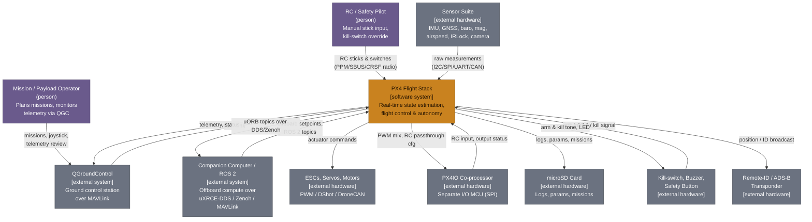
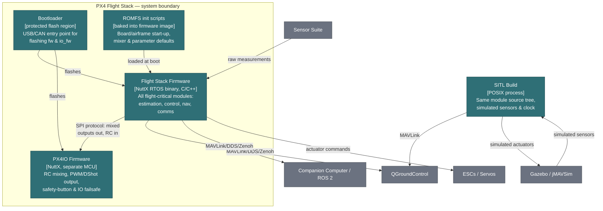
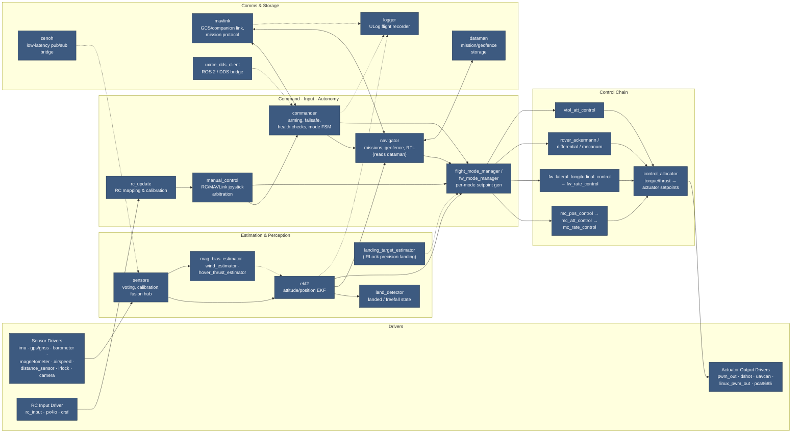
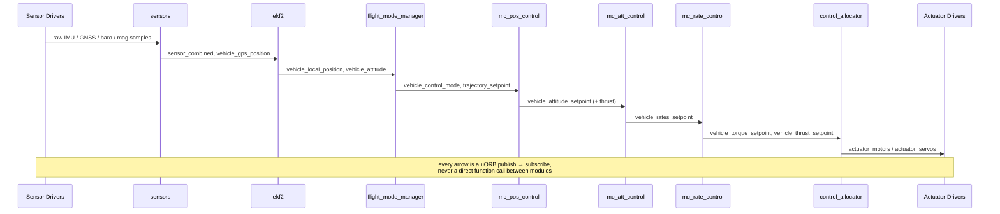

# PX4 Flight Stack — C4 Model

A [C4 model](https://c4model.com/) (Context → Containers → Components → Dynamic) of this Sees fork of
PX4-Autopilot: what the flight stack talks to, what actually gets deployed, how the ~50 runtime modules
divide responsibility, and how that maps onto `src/` on disk.

Rendered version (with light/dark theming and a section nav): [PX4 Flight Stack artifact](https://claude.ai/artifact/8MDFmfvCbTmD6xeyJxAHLo).

Generated from a static read of `vilas/fix/v1.17` — directory listing, module `PRINT_MODULE_DESCRIPTION` text,
and `SEES_V1.17_MIGRATION.md`. Re-derive after any module reshuffle.

## Legend

| Element | Meaning |
|---|---|
| **Person** | A human interacting with the system |
| **System in scope** | The PX4 Flight Stack itself |
| **Container** | An independently deployable/runnable unit |
| **Component** | A module/task running inside a container |
| **External system** | Hardware or software this repo doesn't own |

---

## 1. System Context

The flight stack sits between a human pilot/operator and the physical world it flies through. Everything
outside the flight stack box is hardware or software this repo does not own, but must speak a protocol to —
MAVLink, uORB-over-DDS, PWM/DShot, or a bus like I2C/SPI/CAN.

> QGroundControl is both a command source (missions, parameters, joystick) and a telemetry sink over the
> same MAVLink link.

---

## 2. Containers

Unlike a typical web system, "PX4 Flight Stack" is **not** a fleet of independently deployed services — on a
real airframe it is almost entirely one statically-linked binary. The honest container boundaries are: the
main firmware image, a genuinely separate co-processor firmware (PX4IO), the bootloader that flashes both,
and an alternate build target (SITL) used for desktop simulation instead of real hardware.

A given `boards/<vendor>/<model>` target decides which drivers and modules get linked into the "Flight Stack
Firmware" container — see [Code layout](#4-code-layout).

---

## 3. Components — inside "Flight Stack Firmware"

Everything below runs as its own scheduled task (or work-queue job) inside the one firmware binary. **They
never call each other directly** — every arrow is a publish/subscribe relationship over the `uORB` message
bus (`platforms/common/uORB`, schemas in `msg/*.msg`). Arrow direction shows data flow, not a function call.

Dashed arrows mark lighter/occasional relationships (diagnostic bridges, log sampling, optional inputs)
versus the solid control-and-estimation backbone. In reality *every* node above also holds a direct
subscribe/advertise handle to uORB itself — that fan-out is omitted here for legibility; the arrows shown
are the meaningful data-flow edges.

---

## Dynamic view — multicopter position-hold loop

One concrete run through the Level 3 diagram: a stick input turns into motor commands. This is the
highest-rate path in the system, re-run at up to 500 Hz for the inner rate loop.

---

## 4. Code layout

How the directories in this repository correspond to the elements drawn above.

| Path | Contains | Maps to |
|---|---|---|
| `src/drivers/` | ~70 peripheral driver families (imu, gnss, pwm_out, dshot, uavcan, irlock, tone_alarm, safety_button…) | "Drivers" swimlane, Level 3 |
| `src/modules/` | ~50 application modules — one directory per runtime task (commander, navigator, ekf2, mavlink, logger…) | Most Level 3 components |
| `src/lib/` | Shared libraries linked into modules: `matrix`, `geo`, `mixer_module`, `control_allocation`, `rate_control`, `tecs`, `npfg`, `rtl`, `battery`, `sensor_calibration`… | Implementation detail inside components, not separate C4 elements |
| `src/systemcmds/` | Shell utilities (`uorb`, `param`, `reboot`, `mtd`…) | Operational tooling around Platform Core |
| `platforms/{nuttx,posix,qurt,common,ros2}/` | RTOS/POSIX/QuRT glue, the uORB pub-sub implementation, work queues, HRT scheduler | Platform Core + selects Firmware vs. SITL container |
| `boards/<vendor>/<model>/` | Per-board CMake config: which drivers/modules compile in, default mixer & pinout | Chooses the concrete component set for one Firmware container instance |
| `msg/` (245 files) | uORB topic schemas — the interface contract between every producer and consumer | The wires in the Level 3 diagram |
| `ROMFS/` | Startup shell scripts (`rcS`, airframe & mixer configs) baked into the firmware image | "ROMFS init scripts" container |
| `src/modules/px4iofirmware/` | Firmware for the separate RC-input/PWM-output co-processor MCU | "PX4IO Firmware" container |
| `Tools/` | Build & codegen (uORB message generation), CI, simulation helpers | Build-time tooling — not present at runtime |

---

## 5. Fork overlay — where the Sees customizations land

This is not stock PX4 — it's PX4 v1.17.0-dev with Sees-specific features layered on top (per
`SEES_V1.17_MIGRATION.md`). None of these change the model above; they extend specific components.

| Feature | Touches |
|---|---|
| Safety-pilot RC/Mavlink control-source selector | `rc_update`, `manual_control`, `commander`, telemetry streams in `mavlink` |
| Battery SOC / chemistry curve tuning | `src/lib/battery` |
| Dual-CAN-GPS node-ID ordering | `src/drivers/gnss`, UAVCAN/Cyphal channel assignment |
| Custom magnetometer filtering + noise metric | `sensors` module, `src/drivers/magnetometer` |
| FrSky/Horus telemetry customization | `mavlink` (Smartport DIY streams) |
| Landing-target-estimator auto-start on `SENS_EN_IRLOCK` | `landing_target_estimator`, `commander` start-up logic |
| Default-enabled IRLock / landing-target-pose logging | `logger` |
| STATUSTEXT broadcast to onboard controller without GCS | `mavlink` |
| Extra MAVLink instance | `mavlink` start-up config (`ROMFS`) |
| Audible tone on kill-switch / AUTO_RTL entry (BVLOS compliance) | `commander`, `src/drivers/tone_alarm` |
